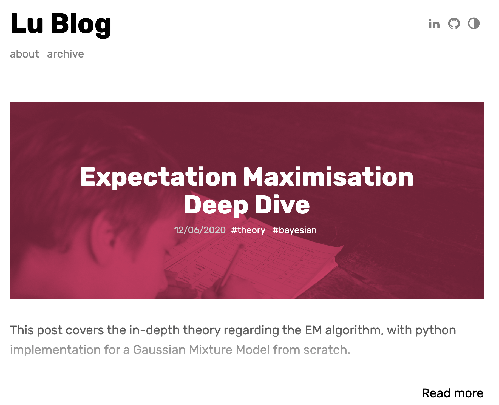
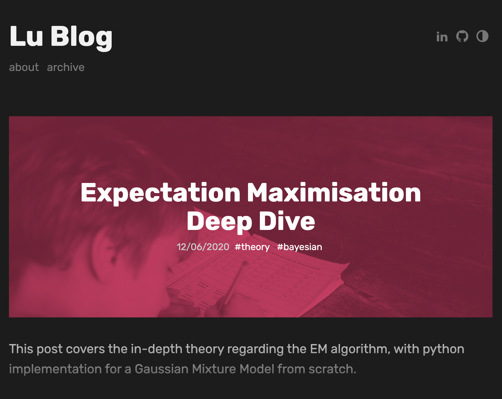

# Data science portfolio
[Full website link](http://xl402.github.io/)

Design is fully based upon modifying [dactl](https://github.com/melangue/dactl).

# dactl
dactl is a fast, modern and configurable [Jekyll](http://jekyllrb.com/) theme with some tricks up it's sleeve. It has a live theme switcher and it's main blog layout display prominent hero images for posts with colored overlays and nice animations.

